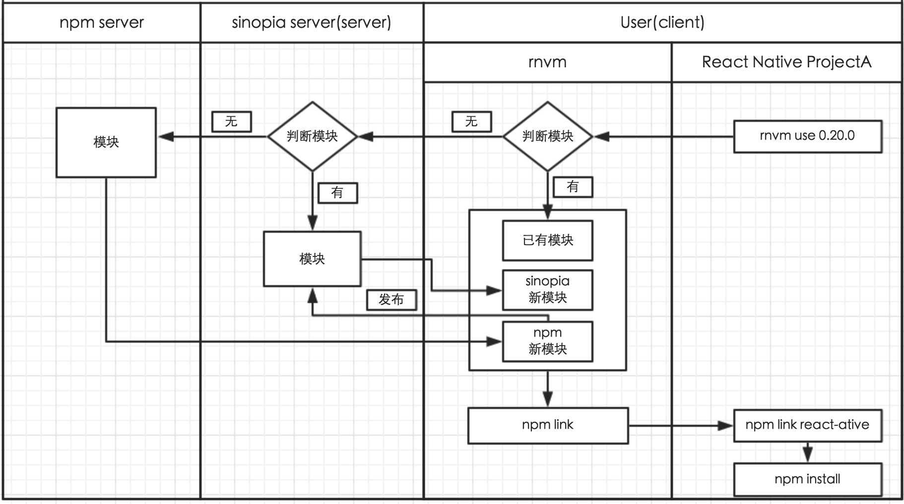
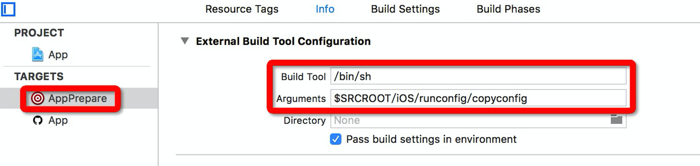

##React-Native 最佳实战之开发环境搭建及扩展

###引言

React Native 的出现，给 APP 开发者们带来了冲动和激情，让 Native 开发者和 Web 开发者都为之痴迷。瞬间各类技术论坛、技术社区甚至出版社都争先报道其相关内容。而然对于一般的初学者来说，最简单要求莫过于按照官方提供的向导来完成基于 React Native 的处女之作。就是这么简单的一个要求，却把无数开发者拒之门外。就其原因，是初学者在按照教程一步一步的搭建过程中，总会出现这样那样的问题，给开发者们的锐气以一个重重的打击。

##一、开发前

###面临的问题

按照官方的向导，在Homebrew 、Watchman、Flow、nvm、node运行环境安装完后，要做的第一件事情便是安装 React Native 命令行工具并由其初始化 React Native 项目。代码如下：

```
$ npm install -g react-native-cli
$ react-native init AwesomeProject
```
然而就是这么两句简短的代码，却运行的也不是那么的顺利。经常会听到开发者们抱怨 “妈蛋，安装个命令行工具，也要让宝宝翻墙吗，真是啃爹呀”。

对于初学者们，最捷径的办法，莫过于参考别人的项目。经常会遇到这么一个场景， 项目中要用到一个slider组件，聪明的开者们很快想到了github，在其一搜发现还真不少，于是乎兴高采烈的将其整个项目clone下来，找到其中的slider组件，纳入自己的项目中，简单的添加了几句引入代码，便急冲冲的执行CMD+R，瞬间模拟器内一片红屏，分析原因，最后发现是fontsize不支持数字了一定要以字符串的方式设置，这是多么沉痛的打击。

玩了一段时间的React Native开发者们应该也会发现，随着开发出来的React Native项目的增多，电脑的存储空间会越来越小了，翻开React Native的历代版本可以看到，gzip之后70M左右，解压后在350M左右。这样的体积大小，几个项目下来，几个G的空间瞬间没了。

那么归纳起来主要是以下几类问题制约着开发者们。  	

+	React Native 命令行环境搭建困难
+	React Native 初始化项目困难
+	React Native 版本升级经常带来API不支持
+	随着React Native 项目的增多，占用空间越大


###原因分析

React Native 命令行环境搭建困难，主要是慢，为什么呢，从代码

```
npm install -g react-native-cli
```
中可以了解到，这是在从npm服务器上拉取react-native-cli。所以慢的原因便是因为npm服务器不在国内。聪明的国人已给出了解决办法，通过翻墙来解决此问题。更高兴的是npm提供了一个register的属性，可以让开发者自由的设置镜像地址。开发者们最常用的便是淘宝的镜像地址。据统计国内比较常用的镜像地址有：

```
http://r.cnpmjs.org/
http://registry.npm.taobao.org/
http://registry.npmjs.eu/
http://registry.npmjs.org.au/
http://npm.strongloop.com/
https://registry.nodejitsu.com/
http://registry.npmjs.pt/

```
这么多眼花缭乱的地址，的要感谢国人开源意识的强大，是他们给开发者们带来了福音，让开发者们再也不用担心下载不到nodejs包了。

这是官网初始化React Native 项目的代码：

```
react-native init AwesomeProject
```
可以看到这是通过"react-native init"这个命令来进行初始化的。那“react-native”这个命令又是从哪里来的呢，起初给笔者带来很大的困惑，上面只安装了“react-native-cli”这个node包，怎么会冒出个“react-native”命令而不是“react-native-cli”命令呢。我们翻开“react-native-cli”的安装目录，mac上是在：

```
/usr/local/lib/node_modules/react-native-cli
```
目录，打开其中的“package.json”文件，可以看到有这么一段代码：

```
"bin": {
  "react-native": "index.js"
},
```
这里简单介绍下bin属性，"bin"是由多个“{ 命令名：文件名 }”组成的一个map。在安装的时候会将每个“命令名”链接到prefix/bin（全局初始化）或者./node_modules/.bin/（本地初始化）。上面代码在安装的时候，会将index.js链接到/usr/local/bin/react-native。这样使用"react-native init"进行初始化的困惑也就可以理解啦。那么这个“react-native init”究竟做了什么呢。继续跟踪，打开index.js，其中的部分代码片段：

```
if (args[0] === 'init') {
    if (args[1]) {
      init(args[1]);
    } else {
          }
  } else {
    ......
  }
```
可以看出，index.js其实只对“init”方法做了处理，具体到“init”方法中又做了些什么呢，截取了部分主要代码如下：

```
1、fs.writeFileSync(path.join(root, 'package.json'), JSON.stringify(packageJson));

2、run('npm install --save react-native', function(e) {
```
其中代码1是动态生成package.json，代码2是在本地安装react-native模块。到此，之前提到的“React Native 初始化项目困难”也就不难理解啦，原因都是npm惹的祸。

既然已经看到这里啦，那就顺带的完整的了解下react-native这个命令。除了“react-native init”命令外，官网还提供了 “react-native bundle”、“react-native run-android”等命令，而index.js稳重却只有“init”命令。那其他命令又是怎么来的呢。带着疑问，笔者又找到了如下的代码：

```
var CLI_MODULE_PATH = function() {
  return path.resolve(
    process.cwd(),
    'node_modules',
    'react-native',
    'cli'
  );
};
var cli;
try {
  cli = require(CLI_MODULE_PATH());
} catch(e) {}

if (cli) {
  cli.run();
} else {
......
}

```
打开“CLI_MODULE_PATH”所指的cli文件，其指向了“module.exports = require('./local-cli/cli.js');”，
继续打开“/local-cli/cli.js”部分代码如下：

```
var documentedCommands = {
  'start': [server, 'starts the webserver'],
  'bundle': [bundle, 'builds the javascript bundle for offline use'],
  'unbundle': [unbundle, 'builds javascript as "unbundle" for offline use'],
  'new-library': [library, 'generates a native library bridge'],
  'link': [link, 'Adds a third-party library to your project. Example: react-native link awesome-camera'],
  'android': [generateWrapper, 'generates an Android project for your app'],
  'run-android': [runAndroid, 'builds your app and starts it on a connected Android emulator or device'],
  'run-ios': [runIOS, 'builds your app and starts it on iOS simulator'],
  'upgrade': [upgrade, 'upgrade your app\'s template files to the latest version; run this after ' +
                       'updating the react-native version in your package.json and running npm install']
};
```
看到这里，也就眼前豁然开朗起来，原来除“init”命令外，其它命令都在这里啦，这让笔者明白了一件事情：也就是说“init”可以在任何地方使用，而其他命令只能在React Native项目的根目录下使用 ，不得不佩服Facebook设计之巧妙。
与此同时，另一件重要的事情也就显得清晰可见了。那就是在“React Native”的开发中，其实有两个“react-native”，一个是的“react-native-cli”生成的全局的react-native命令，一个是在初始化项目时安装的“react-native”模块，即在应用开发中通过“require('react-native')”所引用的模块。这两个简单区别便是，一个是全局的模块，一个是局部的模块。全局模块状只提供了一个“init”方法，而局部模块提供了除“init”方法外的所有命令以及React Native开发中用到的所有功能。

经过上面对"react-native-cli"与“react-native”的分析，可以看出Facebook应该是推荐“react-native”模块局部化，所以不论在React Native项目初始化的过程中，还是clone已有的React Native项目，都需要在当前项目下下载和安装“react-native”模块，使得React Native 项目占用的空间越来越大。


###解决办法

####1、私有NPM搭建

虽然上面讲的国内镜像，已使NPM的下载速度很快啦，但是仍然不如在自己内网架设个NPM私有服务器，给团队成员提供更快捷的下载速度。架设私服，除了速度快以外，还有一个重要的原因就是一些内部的隐私模块也可以发在私服上供内部成员使用。
市面上的NPM私服也有很多，这里推荐的是一个叫“sinopia”的NPM私服。“sinopia”的做法是优先从自己的仓库中拉取模块，如果发现没有，便从远端的NPM服务器拉取。也许有的开发者早已注意到，这个私服其实在“react-native-cli”的NPM库中[react-native-cli](https://www.npmjs.com/package/react-native-cli)就有介绍，笔者猜想应该是Facebook也推荐诸位使用“sinopia”来搭建NPM私服吧。“sinopia”的github地址为：[sinopia](https://github.com/rlidwka/sinopia)。“sinopia”的搭建比较简单，步骤如下：

#####-安装命令：

```
$ npm install -g sinopia

```

#####-启动命令：

```
$ sinopia
```
启动后的日志：

```
warn  --- config file  - /Users/youname/.config/sinopia/config.yaml
warn  --- http address - http://localhost:4873/
```

日志中的“config file”为“sinopia”的配置地址，“http address”为“sinopia”的主页地址。打开“/Users/youname/.config/sinopia/config.yaml”可以看到默认的配置信息如下：

```
//仓库保存的路径
storage: /Users/wagon/.local/share/sinopia/storage
//用户验证相关
auth:
  htpasswd:
//存放用户信息，与max_users一起配合来管理用户
    file: ./htpasswd
//配置npm服务器
 uplinks:
  npmjs:
    url: https://registry.npmjs.org/
//配置模块信息
packages:
//私有模块配置
  '@*/*':
//访问权限的设置
    access: $all
//发布权限的设置
    publish: $authenticated
//公有模块配置    
  '*':
    access: $all
    publish: $authenticated
//公有模块拉取地址的配置，与上面的uplinks属性配合使用
    proxy: npmjs
logs:
  - {type: stdout, format: pretty, level: http}
```
如果想看更完整的配置可以参考这里[full.yaml](https://github.com/rlidwka/sinopia/blob/master/conf/full.yaml)。

#####-创建新用户

```
$ npm adduser --registry http://localhost:4873
```
按照命令行中的提示，依次输入Username、Passworld、Email即可完成用户的创建。

#####-设置npm镜像地址

```
$ npm set registry http://localhost:4873/

```

#####-发布npm包

在发布模块前，需要先登录

```
$ npm adduser
Username：xxx
Passworld：xxx
Email：xxx@xx.com

```
登录完成后，便可进入待发布模块的根目录进行发布了。

```
$ npm publish
```

若没有“package.json”文件的话，需先执行“npm init”进行创建，然后执行上面的命令即可将模块推送到自己的NPM服务器上了。这样我们在安装该模块的时候，便是从自己的NPM服务器上下载了。

#####-远端访问

上面只是在本地搭起了NPM服务器，只能通过本地来访问，如果要做到远端访问的话，需要这样来启动“sinopia”：

```
$ sinopia -l IP地址:端口
```

#####-配置React Native的sinopia服务器

对于react-native的配置，官网建议修改packages和max_body_size的配置如下：

```
......
packages:
  'react-native':
    allow_access: $all
    allow_publish: $all

  'react-native-cli':
    allow_access: $all
    allow_publish: $all

  '*':
    allow_access: $all
    proxy: npmjs
max_body_size: '50mb'
```

从修改中可以看到，主要是对模块发布做了限制，只允许发布‘react-native'和'react-native-cli'模块，其他模块一概不允许发布，猜想应该是怕将其他模块覆盖掉吧。对max_body_size的设置，主要是出于对模块大小的考虑，避免产生"request entity too large"的错误，因为默认的大小为1mb。

服务器配好后，接下来就需要将react-native模块和react-native－cli模块发布上去了。为了方便起见，我们建立如下的目录结构：

```
react_native_modules
    react-native
        v0.21.0
            node_modules
                react-native
        v0.20.0
            node_modules
                react-native
    react-native-cli
        v1.0.0
            node_modules
                react-native-cli


```
其中react_native_modules为我们在用户目录下创建文件夹。之所以设计成这样的结构是为了我们方便现在NPM服务器上的模块。如我们要下载0.19.0版本的react-native模块，我们只需要创建react_native_modules\react-native\v0.19.0文件夹，然后在该文件夹中执行

```
$ npm install react-native@0.19.0
```
即可完成从NPM服务器上对该模块的下载。接下来进入到node_modules\react-native目录，执行

```
$ npm set registry http://host:port/ //要记得切换到sinopia服务器哦，否则会将模块发在NPM服务器上而不是sinopia服务器上

$ npm publish
```

####2、实现多版本管理

如果说sinopia是用来解决速度的问题，那么多版本的管理可以说是用来解决体积的问题。做过node.js开发的同学，都清楚nvm，它是nodejs的版本管理工具，甚至包括React Native的官网也有谈到使用nvm来安装node.js。在react-native版本迭代如此频繁的阶段，居然没有react-native的版本管理工具，这让开发人员们很是受伤。所以，这里将尝试着设计一个react-native的版本管理工具，我们可以亲切的叫它rnvm（react-native version manager）。在了解rnvm的思路前，先了解下rnvm的使用场景.


#####-rnvm的使用场景

rnvm如其名字中的那样，主要是对react-native的版本进行管理的。那么它的使用场景都有哪些呢。这的从一个React Native项目的的获得方式说起。通常情况下有如下几种方式：

a、通过react-native命令初始化项目获得

b、通过从github上clone获得

c、通过拷贝获得

对于a中的使用场景，在react-native初始化项目的时候，正常情况下rnvm是插不上手的。如果真要用rnvm，需要侵入/usr/local/lib/node_modules/react-native-cli/index.js文件，将run('npm install --save react-native'改为run('rnvm use ',或者也可以给rnvm添加一个init命令来取代react-native init命令,使用方式为rnvm init AwesomeProject。

对于b、c场景，可以直接使用rnvm命令进行处理。

然而，这并不是rvnm的优势。rnvm的核心思想是将react-native模块安装在全局目录下，这样每个React Native项目在使用的时候，不需要在本地目录中安装一份，只需要调用全局目录中的react-native即可，给开发者节省了不少的空间。再者rnvm给React Native项目中的对react-native版本的使用带来了灵活性，所以rnvm更适合多React Native项目的开发。

#####-rnvm的目录结构

```
prex_node_modules
	node_modules
		react-native
		react-native-cli			
react_native_modules
    react-native
        v0.21.0
            node_modules
                react-native
        v0.20.0
            node_modules
                react-native
    react-native-cli
        v1.0.0
            node_modules
                react-native-cli

```
还是在用户目录下创建react_native_modules、prex_node_modules两个目录结构。react_native_modules的目录和上面sinopia发布模块用的是一样的结构，都是用来存放模块的。默认的全局安装目录在“/usr/local/lib/node_modules”，这里的prex_node_modules目录就是用替换原有的全局安装目录，这样做的好处是不需要每次装全局模块时都要sudo。

#####-rnvm的执行流程

这里需要结合一个场景来分析rnvm的执行流程，某天开发人员从github clone了一份别人写的React Native的代码，重命名为mycloneproject，想在本地运行起来，正常情况下应该是进入mycloneproject项目的根目录，然后执行npm install。这样就会将package.json中指定的所有依赖模块都安装在当前目录的node_modules目录中。那么使用rnvm是怎么安装的呢。

现在假设rnvm只有一个use命令，格式为 rnvm use version。

具体的执行代码如下：

```
$ cd mycloneproject
$ npm config set prefix ~/prex_node_modules/node_modules
$ npm set registry http://host:port/
$ rnvm use 0.20.0
```
在这个过程中发生了些什么呢？

a、先进入mycloneproject项目的根目录。
b、设置全局模块安装目录为~/prex_node_modules/node_modules。

c、设置npm的镜像指向自己的sinopia服务器，这样之后的所有npm命令就会从sinopia服务器获取模块了。

d、执行rnvm use命令。代码中看到可以使用全局“rnvm”命令，这就要求rnvm是一个node.js的模块，且该模块实现了package.jon中的bin配置，使其支持全局安装。

e、rnvm接收到两个参数之后的行为：

+	在拿到参数后，rvnm会去react_native_modules/react-native中查找是否有v0.20.0目录，如果有则进入该目录，并执行npm link

+	如果没有，则创建v0.20.0目录，并进入该目录执行npm install react-native@0.20.0。

+	执行完后，进入node_modules/react-native中，执行npm link

+	接着在回到mycloneproject项目根目录，执行npm link react-native，然后在执行npm install。这样mycloneproject项目的依赖模块就都安装完毕，且使用了0.20.0版本的react-native，

这便是一个rnvm的基本执行流程。当然，这里也可能会有些特殊情况，如只使用rnvm use不传版本信息，这样rnvm就需要先分析package.json中的react-native的版本信息，并结合npm info react-native获取来的版本信息进行处理，得出最终需要的版本信息，然后在执行rnvm use 最终的版本信息。

这只是个use命令的执行分析。也可以像nvm一样，实现rnvm install、rnvm ls、rnvm current等命令。

rnmv的github地址：[rnvm](https://github.com/GammaGos/ReactNative/rnvm/)


####3、完整架构


图1 基于rnvm的开发架构图

基于上面的图形，这里做简短的描述。总体分为两个大的部分，一个是server端，一个是client端。server端是指sinopia服务所在的端，主要负责提供NPM私有服务。在搭建该端的时候，需将常用的react-native版本和react-native-cli版本都推送到该服务器上，便于之后客户端的使用。client端是指用户端也就是开发者端。该端负责React Native项目的构建。该端属于消费端是主战场。
在上图中，该端主要发生的逻辑为：

1、开发者先构建了一个React Native ProjectA项目

2、然后使用rnvm来安装依赖模块，

3、rnmv接着在指定的目录下判断是否有对应的模块，

4、有的话会先找到对应的模块，然后再去模块根目录下做npm link的操作，然后回到React Native ProjectA项目的根目录，执行npm link react-native操作，接着执行npm instal的操作。

5、如果没有找到对应模块的话，会向sinopia服务器发送请求，

6、请求下载需要的模块，并放入指定的目录中，

7、待模块下载完毕后， 执行4中的操作。

8、如果sinopia服务器也没有的话，会像npm服务器发起请求

9、待模块下载完后，执行4中的操作。

10、然后，在将改模块publish到sinopia服务器上。


##二、开发中

###面临的问题

通常项目中，App需要开发Android和iOS两个版本,经常会用到一些图片，并需要将这些图片打入App中。当开发iOS版本时，需要手动加载这些图片资源到xcode中。当开发Android版本时又需要手动的加载一次。这样，当某天某个图片需要更新时，就需要对Android和iOS都进行修改。如果要是能够让两个版本引用同一个图片,那么就会使开发变的简便。

###解决办法

####起初的想法

我们可以借助shell脚本创建、搬运、解析文件的能力，加上一些自定义的规则，来实现Andorid、iOS两个版本引用同一个图片的功能。

下面来简短的介绍下实现思想

iOS版本在Images.xcassets文件夹中创建符合规则的图片文件以及文件夹。Android版本在drawable-hdpi,mdpi等文件夹中创建符合规则的图片。那么这个规则是什么呢，我们可以通过使用json形式的congfig文件来定义这个规则，格式如下:

```
{
  "resources":[
    {
      //资源的别名
      "name":"rose",
      //资源的类型
      "type":"image",
      //资源路径，可以相对也可以绝对
      "url":"resources/image/rose.png",
      ......
    },
    {
      "name":"flower",
      "type":"image",
      "url":"http://host/path/imagename.jpg"
      ......
    }
  ]
}
```


然后再借助Shell的jq插件，通过解析刚才定义的congfig文件来获得约定的规则，获得规则的主要shell代码如下：

```
......

index=0;
flag=0;
while ((flag<=0));do
read imgname <<<  $(cat ./../../resources/image/resource.json |./jq '.[]' |./jq '.['$index']'|./jq '.name')
read url <<<  $(cat ./../../resources/image/resource.json |./jq '.[]' |./jq '.['$index']'|./jq '.url')
 done
 /**省略创建图片的代码**/
```
待获得规则后，就可以根据规则生成各个版本对应的图片。到此，shell脚本的主体逻辑已经介绍完成，是时候把它融合到两个版本的实际项目中运行了。

在Android版本中，我们可以通过开发一个Unix executable文件，来封装自己的run-android运行命令，代码如下：

```
/**省略前面解析json与创建图片的代码**/
cd ../<android项目路径>/
react-native run-android
```
待启动Android项目后，图片顺利的读取到了。

在iOS版本中，我们可以通过开发一个shell脚本，并把它添加到Xcode项目的run script phase中，待启动iOS项目后，却发现资源文件根本读不到。这是为什么呢?

####原因分析

#####-iOS中React Native项目启动顺序：

+	在启动React Native Xcode项目时，会先加载项目所依赖的React项目，接着运行React项目中事先定义好的run script phase，最后运行packger.sh。

+	其中packger.sh中我们看到如下的代码：

```
node "$THIS_DIR/../local-cli/cli.js" start "$@"
```
+	接着我们找到了cli.js，看到里面调用了好多模块。其中default.config.js模块指定了JS和资源的加载路径，server.js模块除了指定server监听的默认端口外还有检测node版本等功能，runServer.js模块用来启动server。

+	待server启动成功后，才运行到iOS native code。也就是这个时候，才会运行Xcode项目中，事先定义好的run script phase中指定的shell脚本，而在这个时候，在shell脚本中创建资源路径是没有用的。所以就会出现了上面资源文件读不到的情况。

#####-Android中React Native项目启动顺序：

+	首先执行上面封装好的Unix executable文件，该文件中会调用资源文件生成的代码，将资源文件生成。

+	然后在该文件中会继续再执行react-native run-android命令，此时根据react-native-cli模块的package.json中bin的定义，调用node.js执行$prefix/react-native-cli/index.js。

+	在index.js中会先加载cli.js模块然后运行其run方法。在cli.js模块中做的工作和上面分析的iOS中的cli.js做的工作是一样的。

+	待server启动成功后，才会运行到Android native code,所以运行封装好的Unix executable是不会导致资源失效的，因为资源生成代码已经在react-native run-android命令运行之前被执行过了。


####最终的解决办法

为了让资源生成的代码执行顺序提前，可以先增加一个名为AppPrepare的Command类型项目，来运行此Shell。然后在Xcode项目Target Dependencies中添加AppPrepare项目，这样就会先运行AppPrepare的项目后才会运行Xcode项目，从而达到了我们的目的。


图2 Xcode项目依赖图
