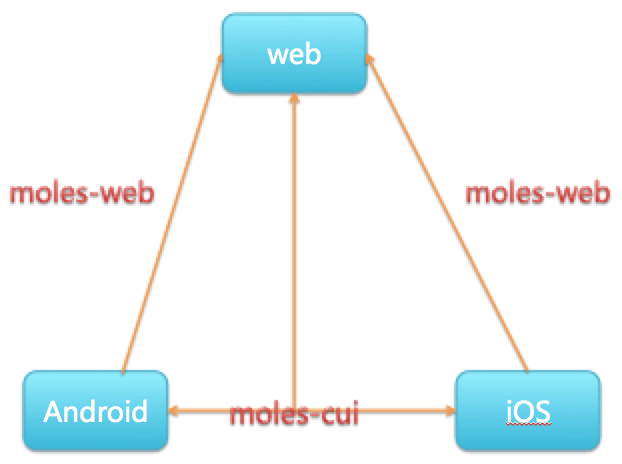
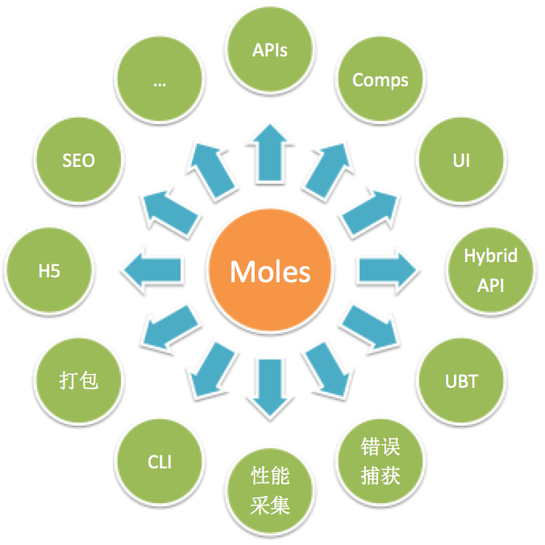
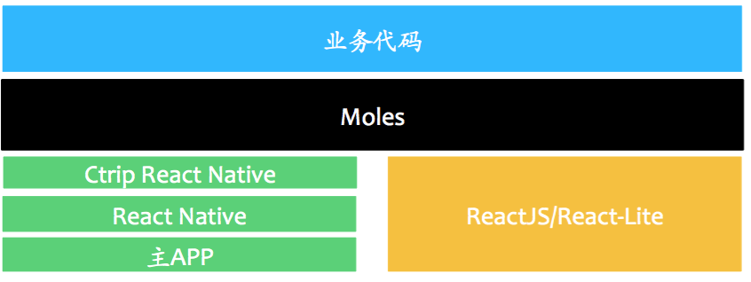
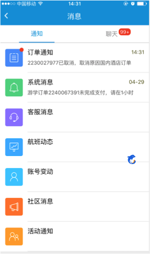

## React Native框架之Moles

Hello 大家好，我是携程技术中心框架研发部的魏晓军，很高兴能在这里给大家一起交流。感谢大家关注我们的技术微分享。我目前就职于框架研发部前端框架组，主要负责PC端、移动端的框架开发以及一些性能优化等工作。现阶段主要从事React Native的研究和引入工作。今天我带来的分享主题是React Native框架之Moles。主要是想通过对Moles框架的分享，让大家了解我们携程现在在React Native方面的实战经验。希望能够给大家在今后的开发中提供一些经验和帮助。

本次分享主要包括：

1、Moles框架在React Natie和我们主App的集成中所起的作用。

2、Moles框架是如何打通Android、iOS、H5、SEO，让我们一套代码跑在多个平台上。

3、Moles框架的组成以及简单原理分析。

下面正式开始我们今天主题的分享React Native框架之Moles。


### React Native的现状

React Native是15年3月份Facebook开源的一个Native上的一个框架。那么他现在为什么这么火呢。先看看他的优点。首先，对于做前端的我来说，最吸引我的就是可以用javascript来开发Native应用了。之前javascript只可以开发浏览器上的一些功能，随着Node.js的出现，又让javascript走向了服务端，现在React Native的出现又让javascript走向了Native端。所以要用现在一个时髦的词来形容javascript的话，我觉得“全栈”真的不为过。其次，我们React Native是Facebook将ReactJS的思想移植到Native端。所以React Native就拥有了RectJS的很多特性，如：组件化思想、Virture Dom技术以及JSX与Flexbox组合完成的布局等等，同时React Native又引入了热更新机制、CssLayout机制，让开发人员尤其是Native开发人员眼前一亮。那在看看他的不足，我们知道React Native先出的iOS版本，然后出的android版本。而且两个版本之间存在很多的差异性，甚至有好多组件都会带有平台的后缀，这使得开发人员必须要为这两个平台写不同的代码。此外，对于公司来说，在移动上的投入，不仅有App还会有H5，而在H5上React Native并没有考虑。从MVC框架的角度来看，React Native只做了View这一层，那么Controller、Model、Router还需要做。从App的这个完整性来看，只学会React Native并不能开发一个健全的App。他的更新策略、Hybrid API的提供，配套的UI组件、监控机制等等这些都没有。


### Moles 框架的出现

伴随着React Native项目的开发，逐渐的Moles框架就形成了。mole [məʊl] 小鼹鼠，是种凿洞能力非常强的老鼠。把框架称为之为mole，也是寄希望我们的框架能像mole一样，能够打洞，能够打通Android、iOS、H5、SEO这几个平台。当然一个mole的能力是有限的，所以我们取其复数形式moles。

如果说当前移动端的三大痛点是：性能、动态性、多端适配的话。那么我认为React Native解决了性能、动态性，而我们Moles则解决了多端适配的问题。

Moles的理想是要尽可能的做到在H5端开发的内容可以直接运行在Native上，在Native端开发的内容也可以直接运行在H5上。

###Moles 框架的组成

主要分三部分组成

####－moles-web
该部分主要是为H5服务，是将React Native在Android、iOS中`没有差异化`的components、APIS抽出来单独封装成一个模块供web端来使用。
####－moles-cui
该部分主要是是将React Native在Android、iOS中`有差异化`的components、APIS抽出来，并且添加一些公司定制化的组件进去，包括：UI组件、监控组件、采集组件等。

####－moles-cli

该部分主要包括Moles项目的初始化、编译、打包等功能

下面是它们三者间的一个关系图




###Moles 框架的功能

Moles框架的功能可以用下图来说明



主要涵盖的对不同平台的适配、对底层API的调用以及对APP中性能和错误的监控等等。

那么Moles在携程主App中所处的位置如何呢，如下图所示


它就是BU开发人员和React Native、Ctrip React Native 的一个桥梁。让开发人员更专注于自己的业务逻辑，而不必为React Native的更新问题、不同平台的兼容性问题等而烦恼。


###Moles 框架的原理简析
由于Moles涉及的内容众多，如：路由的设计、页面生命周期的设计、打包的设计等等。这里我们仅以组件的设计为例，来简析其实现原理。

要做到Native和H5代码共享，通常想到的做法有两种：

1、Native组件运行在H5上，如：

```
class HelloWorld extends Component{
  render(){
    <View>
      <Text>HelloWorld</Text>
    </View>
  }
}
```

2、H5组件运行在Native上，如：

```
class HelloWorld extends Component{
  render(){
    <Div>
      <Span>HelloWorld</Span>
    </Div>
  }
}
```

Moles中组件的设计采用了做法1的思路，就是将Native上支持的View、Text、Navigator等组件运行在H5上。要实现Native组件运行在H5上，需要解决两点：1、组件化 2、组件的生命周期。我们刚开始的时候就讲到，React Native上的组件化思想是Facebook将ReactJS的思想用在Native上。这就为我们能在H5上实现Native的组件奠定了基础。所以我们完全可以借助ReactJS来开发这些组件，但是在实际的开发中，发现ReactJS的体量实在是太大了，所以我们最后采用了携程开源的react-lite框架。
###Moles 框架的使用
为了减少大家的学习成本，Moles框架在设计方面尽量采用大家比较熟悉的语法或命令。要使用Moles，需要先安装moles-cli。

下面是第一次使用moles-cli的简单流程：

安装

```
$ sudo cnpm install moles-cli -g

```
初始化项目

```
$ moles-cli init ProjectName
```
安装项目依赖

```
$ cd ProjectName
$ cnpm install
```
moles-cli初始化后的目录结构几乎和react-native-cli初始化出来的结构一样，唯一不同的是多了一个web目录，该目录主要是为H5服务。

下面来看下简单的代码使用情况

```
import React,{
  View
} from 'react-native'

```
上面的代码若在Native端会调用React Natie提供的react-native模块，在H5端会调用moles-web模块

```
import{
  Application,
  Page
}from 'moles-cui'

```
上面的代码为moles-cui的使用，不论在Native端还是H5端，都需要通过引入'moles-cui'模块来使用。


###Moles 框架的案例

目前我们的Moles框架已在携程的主App上投入生产，有兴趣的同学可以安装我们的携程App6.17，进入我的携程，其中的站内信频道就是基于我们Moles框架开发的。现在还有攻略、游轮等频道也在陆陆续续的接入中。相信在不久的将来，大家会在携程的各大频道上看到我们Moles的身影。我们也希望Moles能成为携程乃至业内基于React Native开发项目的必须框架。

下面是基于Moles开发的效果图：



我携频道


攻略频道


###开源计划
记得上次分享的时候，就有不少同学咨询开源的事情。我这里简述下，我们Moles未来将是一个开源的框架。是一个为开发React Native项目提供解决方案的开源框架。我们会将Moles框架的相关产品逐步的开源给大家。

目前我们已将Moles框架的打包工具moles-packer开源在了github上。


**关于moles-packer的一些介绍：**

moles-packer 是由携程框架团队研发的，与携程Moles框架配套使用的React Native 打包和拆包工具，同时支持原生的 React Native 项目。

当前版本:`0.1.3`

[github地址](https://github.com/ctripcorp/moles-packer):`https://github.com/ctripcorp/moles-packer`

[npm地址](https://www.npmjs.com/package/moles-packer):`https://www.npmjs.com/package/moles-packer`

**想看更多的内容，请关注我们的Moles的公众号：**


